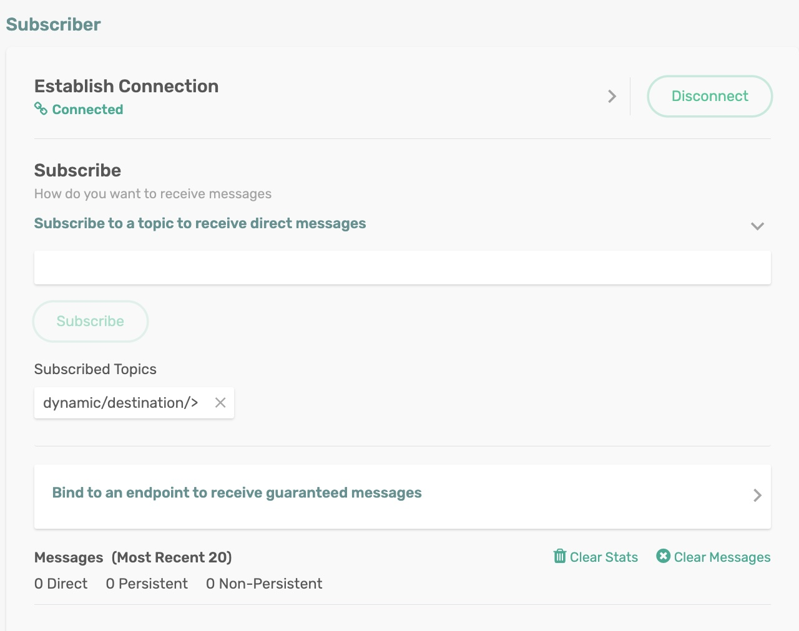
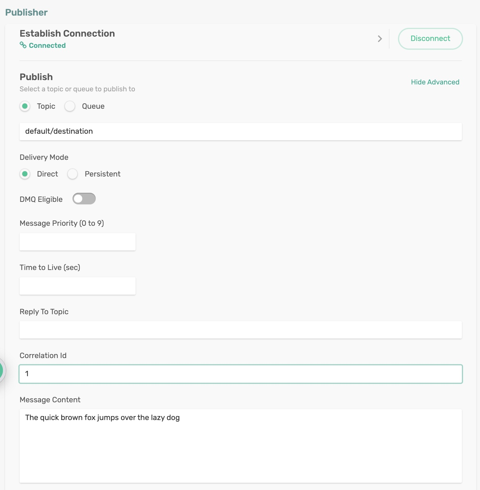
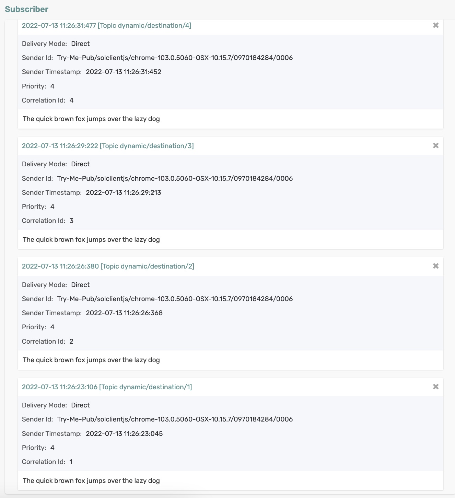

# Dynamic Producer Destination

Spring Cloud Stream has a message header called `scst_targetDestination` retrievable via `BinderHeaders.TARGET_DESTINATION` allows for messages to be redirected from their bindings' configured destination to the dynamic target destination specified by this header.

## Requirements

To run this sample, you will need to have installed:

Java 8 or Above

## Code Tour

In the DynamicProducerDestination application, review the function code.

```
@Bean
public Function<Message<String>, Message<String>> dynamicDestination() {
    return v -> {
        System.out.println("Received dynamicDestination: " + v.getPayload());
        System.out.println("CorrelationID: " + v.getHeaders().get("solace_correlationId"));
        
        // Use whatever business logic you'd like to figure out the topic!
        String cid = (String) v.getHeaders().get("solace_correlationId");
        if (cid == null) {
            cid = Integer.toString(1);
        }
        String myTopic = "dynamic/destination/".concat(cid);
        System.out.println("Publishing to: " + myTopic);
        return MessageBuilder.withPayload(v.getPayload())
                                .setHeader(BinderHeaders.TARGET_DESTINATION, myTopic)
                                .build();           
    };
}

```

On the received message, the correlation ID is used to construct a dynamic topic - `"dynamic/destination/{cid}"`

## Running the application

Make sure to update the Solace Broker connection details with the appropriate host, msgVpn, client username, and password in `spring.cloud.stream.binders.solace-broker.environment` settings.

```
cd dynamic-producer-destination
mvn clean spring-boot:run
```
This will start the Spring Boot application.

### Create a Subscriber

Subscribe to the topic `dynamic/destination/>` either programmatically or using the Subscriber tool in the `Try Me!` utility of the Solace Broker console.

<p align="center"></p>


### Publish Messages

Publish a message on the topic `default/destination` either programmatically or using the Publisher tool in the `Try Me!` utility of the Solace Broker console. 

On each published message, set the correlation ID to random values - say, a number sequence starting with 1 - simulating the dynamic topic destinations built by combining the correlation ID on the received message (like `dynamic/destination/1`, `dynamic/destination/2` and so on).

Publish messages with correlation ID set to 1 to 5.

<p align="center"></p>


In the terminal, you can see the messages are published to dynamic topics constructed by combining `dynamic/destination` + correlation ID on the received message.

```
Received message on topic default/destination: The quick brown fox jumps over the lazy dog
CorrelationID: 1
Publishing to: dynamic/destination/1
Received message on topic default/destination: The quick brown fox jumps over the lazy dog
CorrelationID: 2
Publishing to: dynamic/destination/2
Received message on topic default/destination: The quick brown fox jumps over the lazy dog
CorrelationID: 3
Publishing to: dynamic/destination/3
Received message on topic default/destination: The quick brown fox jumps over the lazy dog
CorrelationID: 4
Publishing to: dynamic/destination/4
Received message on topic default/destination: The quick brown fox jumps over the lazy dog
CorrelationID: 5
Publishing to: dynamic/destination/5
```

On the subscriber tool of `TryMe` utility, you can see the messages are received on different topics.

<p align="center"></p>


🔥 Yes, Now you can publish to dynamic topics programmatically within your code! 🔥