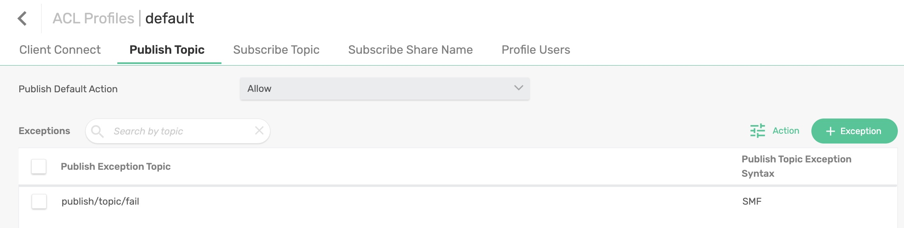
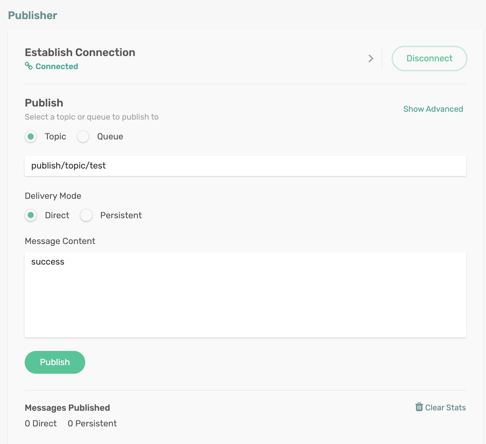
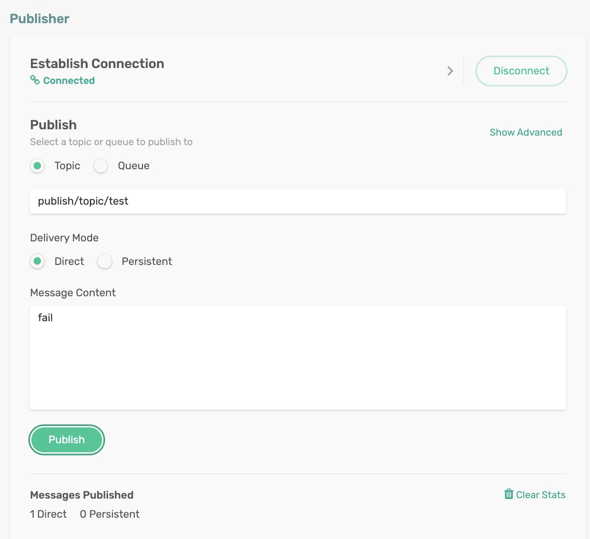

# Publish Confirmation Failure

A published message may be rejected and discarded by the Solace PubSub+ Broker. For example, if the application does not have the proper ACL permissions to send the message, then the message would be discarded. In such cases, the Solace Broker sends back to the publisher a message rejection, a.k.a. negative acknowledgment, indicating the message could not be persisted and was discarded. This feature is exposed via publisher confirmation in the Solace Cloud Stream binder.

You can create a new CorrelationData instance for each message and set it as the value of your message’s SolaceBinderHeaders.CONFIRM_CORRELATION header. CorrelationData can be extended to add more correlation info. 

The SolaceBinderHeaders.CONFIRM_CORRELATION header is not reflected in the actual message published to the broker, and behind the scene, the binder maps the publisher acknowledgment to the confirm correlation feature.

## Requirements

To run this sample, you will need to have installed:

Java 8 or Above

## Code Tour

In the Consumer function, we will create a `CorrelationData` object and set it on the published message header. 

```
CorrelationData correlationData = new CorrelationData();
Message<String> message = MessageBuilder.withPayload("My Payload")
        .setHeader(SolaceBinderHeaders.CONFIRM_CORRELATION, correlationData)
        .build();
```

After a successful publish/send operation, we can check on the `CorrelationData` object we set on the message to see if it was successful or not. An unsuccessful publish operation due to ACL, or other reason would throw an exception - hinting at a failed publish operation.
 
```
try {
    correlationData.getFuture().get(30, TimeUnit.SECONDS);
    System.out.println("Publish Successful");
    // Do success logic
} catch (InterruptedException | ExecutionException | TimeoutException e) {
    System.out.println("Publish Failed - Implement error handling logic here...");
    // Do failure logic
}
```

## Running the application

The publish permissions of the Solace client username `default` used by the Spring Cloud Stream application is tied `default` ACL profile. The publish and subscribe topic permissions are managed through the `default` ACL profile. 

First, let us add an exception to the `default` ACL profile to deny publish permission to the topic `pubish/topic/fail`.

<p align="center"></p>

To dynamically control and test the publish operation, we will use the incoming message payload - a value of 'fail' would publish to topic `publish/topic/fail`, otherwise to `publish/topic/success`. Based on the ACL settings, we know that a publish to `publish/topic/fail` topic would fail with publish permission denied error.

```
cd publish-confirmation
mvn clean spring-boot:run
```
This will start the Spring Boot application.

### Publish a message to trigger a successful publish

Publish a message on the topic `publish/topic/test` with message content set to string value `success`, either programmatically or using the Publisher tool in the `Try Me!` utility of the Solace Broker console. 

<p align="center"></p>

In the terminal, you can see the consumer received the message and published a message to the topic `publish/topic/success`- no errors in this scenario.

```
Received: success
Sending to: publish/topic/success
Publish Successful
```

### Publish a message to trigger an unsuccessful publish

Publish a message on the topic `publish/topic/test` with message content set to string value `fail`, either programmatically or using the Publisher tool in the `Try Me!` utility of the Solace Broker console. 

<p align="center"></p>

In the terminal, you can see the consumer received the message and attempted to publish a message to the topic `publish/topic/fail`. This will fail the `correlationData.getFuture().get(30, TimeUnit.SECONDS);` call with a runtime-exception, indicating a publish failure.

```
Received: fail
Sending to (fail): publish/topic/fail
2022-07-13 12:14:32.140  INFO 61561 --- [1_ReactorThread] c.s.jcsmp.impl.JCSMPXMLMessageProducer   : Client-2:Flow-62: Error Response (403) - Publish ACL Denied - Topic 'publish/topic/fail'
2022-07-13 12:14:32.174  WARN 61561 --- [ducerDispatcher] .s.s.c.s.b.u.JCSMPSessionProducerManager : Producer received error for message 1158 (Spring message 46718a83-939c-e0b8-e1ce-e6a055be460a) at 1657694672152com.solacesystems.jcsmp.JCSMPErrorResponseException: 403: Publish ACL Denied - Topic 'publish/topic/fail'
    at com.solacesystems.jcsmp.impl.JCSMPXMLMessageProducer.getAndProcessResponse(JCSMPXMLMessageProducer.java:1508) ~[sol-jms-10.13.1.jar:na]
    at com.solacesystems.jcsmp.impl.JCSMPXMLMessageProducer.handlePubMsgResponse(JCSMPXMLMessageProducer.java:2073) ~[sol-jms-10.13.1.jar:na]
    at com.solacesystems.jcsmp.impl.flow.PubFlowManager.handlePubMsgResponse(PubFlowManager.java:667) ~[sol-jms-10.13.1.jar:na]
    at com.solacesystems.jcsmp.protocol.impl.TcpClientChannel.handleMessage(TcpClientChannel.java:1702) ~[sol-jms-10.13.1.jar:na]
    at com.solacesystems.jcsmp.protocol.nio.impl.SubscriberMessageReader.processRead(SubscriberMessageReader.java:98) ~[sol-jms-10.13.1.jar:na]
    at com.solacesystems.jcsmp.protocol.nio.impl.SubscriberMessageReader.read(SubscriberMessageReader.java:139) ~[sol-jms-10.13.1.jar:na]
    at com.solacesystems.jcsmp.protocol.smf.SimpleSmfClient.read(SimpleSmfClient.java:1191) ~[sol-jms-10.13.1.jar:na]
    at com.solacesystems.jcsmp.protocol.nio.impl.SyncEventDispatcherReactor.processReactorChannels(SyncEventDispatcherReactor.java:206) ~[sol-jms-10.13.1.jar:na]
    at com.solacesystems.jcsmp.protocol.nio.impl.SyncEventDispatcherReactor.eventLoop(SyncEventDispatcherReactor.java:157) ~[sol-jms-10.13.1.jar:na]
    at com.solacesystems.jcsmp.protocol.nio.impl.SyncEventDispatcherReactor$SEDReactorThread.run(SyncEventDispatcherReactor.java:338) ~[sol-jms-10.13.1.jar:na]
    at java.lang.Thread.run(Thread.java:750) [na:1.8.0_321]

Publish Failed - Implement error handling logic here...
```

In essence, using `CorrelationData`, you can check for publish confirmation success/failure scenarios and take remedial actions as appropriate.


🔥 Yes, Now you can verify whether your publish operation is successful or not within your code! 🔥