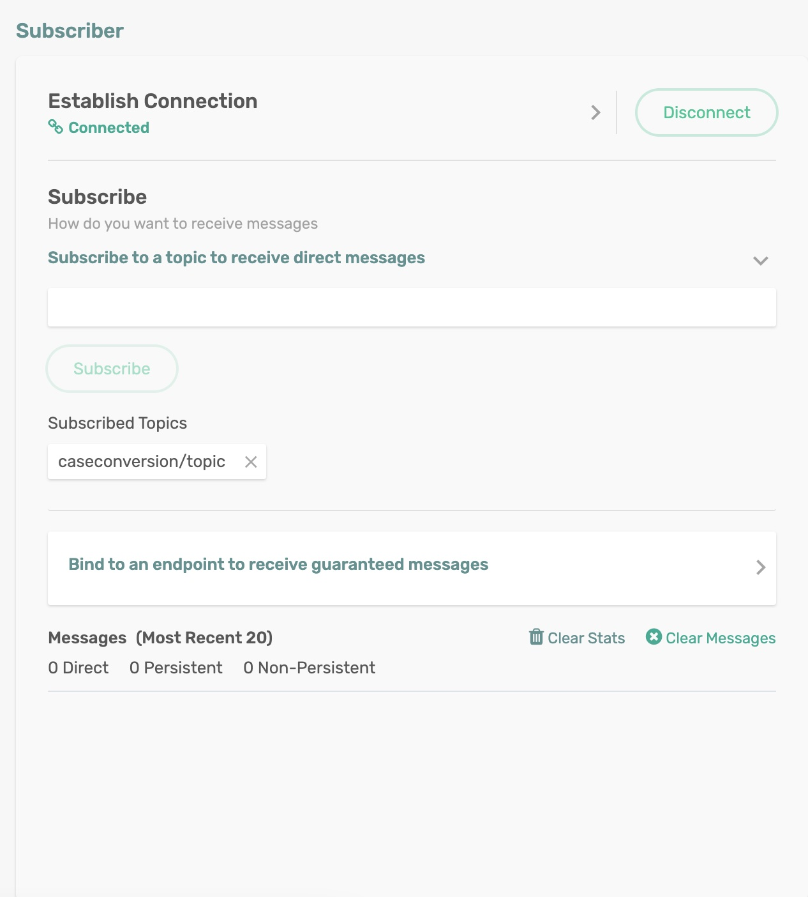
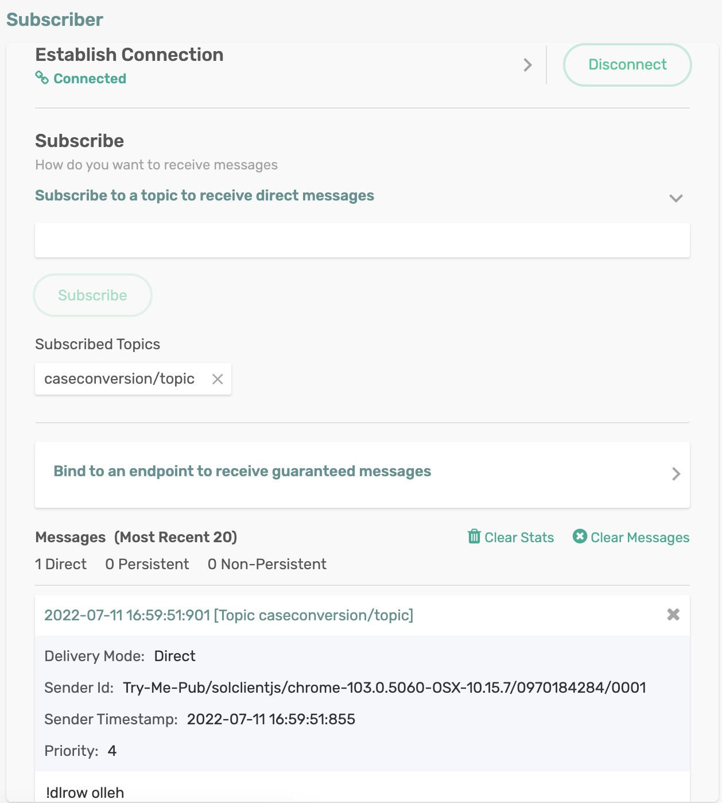

# Simple Spring Boot Demo

In this Spring Cloud Stream sample, we will show how multiple functions can be defined in a single application and establish binding to destinations with Solace PubSub+ Broker as the underlying messaging system.

## Requirements

To run this sample, you will need to have installed:

Java 8 or Above

## Code Tour

Spring Cloud Function includes some great features to take composing functions to another level.

Declarative Composition - In our code, we have defined three functions.
```
@Bean
public Function<Message<String>, Message<String>> uppercase() {
    ...
}
@Bean
public Function<Message<String>, Message<String>> reverse() {
    ...
}
@Bean
public Function<Message<String>, Message<String>> lowercase() {
    ...
}
```
We can compose these functions using the spring.cloud.function.definition property `spring.cloud.function.definition=uppercase|reverse|lowercase`

Here | is a composition operator which results in an autoconfigured bean implementing the composite function, along with related resources to let you seamlessly invoke the composite function.

A message received on the `composeFunctionQueue` would be passed through each of the functions and the final result will be published to the topic `caseconversion/topic`


## Running the application

Make sure to update the Solace Broker connection details with appropriate host, msgVpn, client username and password in `spring.cloud.stream.binders.solace-broker.environmet` settings.

```
cd simple-spring-boot-demo
mvn clean spring-boot:run
```
This will start the Spring Boot application.

Subscribe to topic `caseconversion/topic` either programmatically or using the Subscriber tool in the `Try Me!` utility of the Solace Broker console.

<p align="center"></p>

Publish a message on the topic `composeFunctionQueue` either programmatically or using the Publisher tool in the `Try Me!` utility of the Solace Broker console.

<p align="center"></p>

Now, you can see the received message on the topic that contains processed string.

<p align="center"></p>


In the terminal, you can see debug messages indicating the invocation of bean functions in sequence.
```
Entering uppercase
uppercase input: Hello world!
uppercase output: HELLO WORLD!
Entering reverse
reverse input: HELLO WORLD!
reverse output: !DLROW OLLEH
Entering lowercase
lowercase input: !DLROW OLLEH
lowercase output: !dlrow olleh
```

🔥 Hope this helps you get started with Spring Cloud Stream binder for Solace PubSub+ 🔥